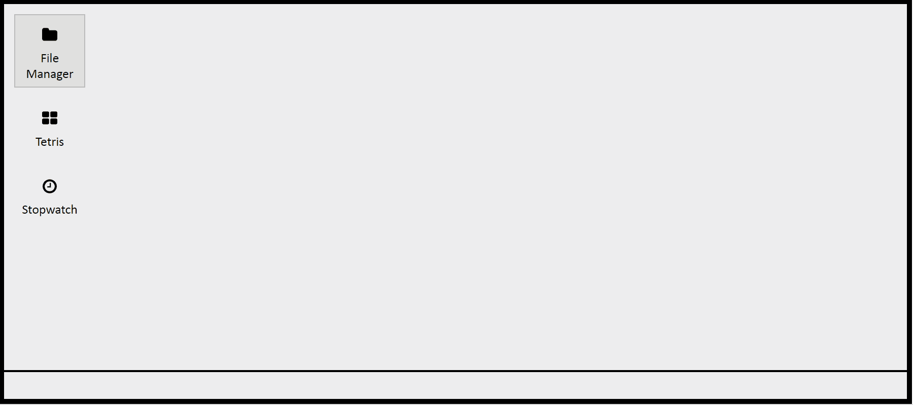

React Orcus
====

[](https://www.npmjs.com/package/react-orcus) [](https://g.codefresh.io/public/accounts/joshuacwebdeveloper/pipelines/5e65bd75d7e4d02008a90182)

React library for creating an app with a windowed desktop interface.

- [Installation/Setup](#installation)
- [Examples](#examples)
- [API](#api)



## <a name="installation"></a>Installation/Setup
Run:

`npm install react-orcus`

and then import it in your app:

`import Orcus from 'react-orcus';`

-- OR --

Include it in your HTML header:

`<script type="text/javascript" src="./react-orcus/dist/react-orcus.min.js"></script>`

Then, in your React component:
```JavaScript
var Desktop = (
    
    <Orcus.Desktop
        shortcuts={false}
        taskbar={false}
        programMenu={false}
    />
        <Orcus.App
            slug="file-manager"
            name="File Manager"
            icon="file"
            initialOpened={true}
            initialPosition={[150, 200, 500, 300]}    //{x, y, w, h}
        >
            <h1>Welcome to my File Manager</h1>
            
            <p>Yeah so.... building a file manager is really hard.
            But please enjoy this complimentary welcome paragraph!</p>
        </Orcus.App>
        
        <Orcus.App
            slug="tetris"
            name="Tetris"
            icon="blocks"
            initialPosition={[550, 200, 200, 600]}    //{x, y, w, h}
        >
            <p>Does anyone know how to build a tetris game?</p>
        </Orcus.App>
    </Orcus.Desktop>
    
);
```

## <a name="examples"></a>Examples

## <a name="api"></a>API
